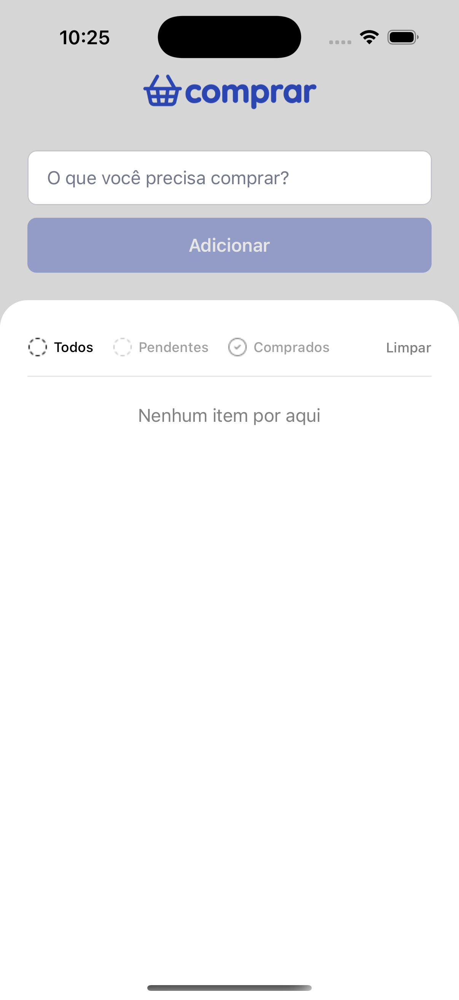
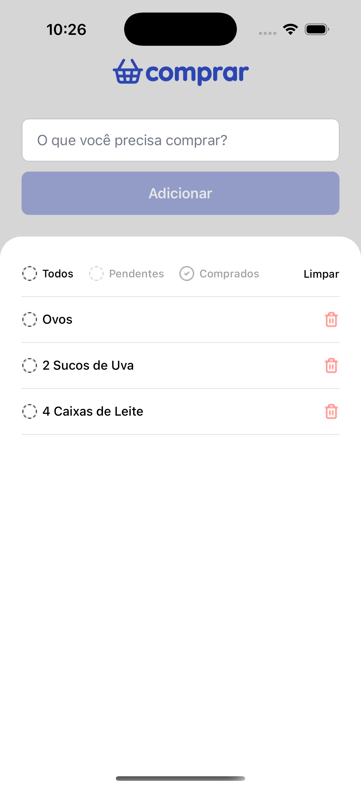
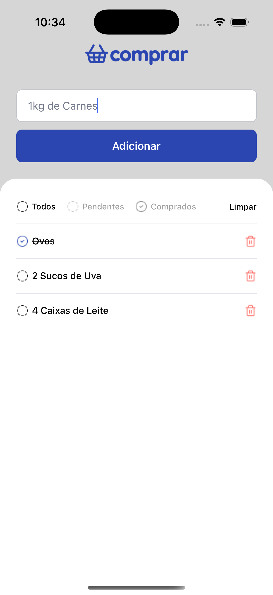

# ComprarApp

<div align="center">
  
  

  <h3 align="center">🛒 Sua Lista de Compras</h3>

  <p align="center">
    
    
    
    
    
  </p>

  <p align="center">⚠️ <strong>Em desenvolvimento ativo</strong> — este projeto está sendo atualizado e melhorado continuamente.</p>

</div>

<div align="center">
  
  
  
</div>

## 📱 Sobre o Projeto

ComprarApp é uma aplicação móvel desenvolvida para simplificar sua experiência de compras. Com uma interface intuitiva e recursos poderosos, o app permite que você:

- ✨ Crie e gerencie sua listas de compras
- 📝 Adicione, edite e remova itens facilmente
- ✅ Marque itens como comprados
- 🎨 Interface moderna
- � Performance otimizada
- 💾 Persistência local de dados
- �📱 Suporte a gestos e animações fluidas

### 🎯 Projeto ComprarApp é voltado para estudos, testes e aplicação de boas praticas!

O ComprarApp é um projeto desenvolvido para fins de estudo e experimentação.
Trata-se de uma ferramenta simples, mas completa, que demonstra diversos recursos do React Native na prática, voltada para o gerenciamento de listas de compras.
Construído com as tecnologias mais modernas do ecossistema React Native, o app oferece:

- **Simplicidade**: Interface limpa e intuitiva
- **Velocidade**: Resposta instantânea às suas ações
- **Confiabilidade**: Seus dados sempre seguros e disponíveis
- **Acessibilidade**: Design pensado para todos os usuários

ComprarApp is a cross-platform mobile app built with React Native, designed to simplify and organize your shopping experience.
Combining modern technologies with clean architecture, it offers a fast, consistent, and user-friendly experience across iOS and Android devices.

## ⚡ Stack Tecnológica

### Core & UI

- [React Native](https://reactnative.dev/) (v0.82.0) - Framework base para desenvolvimento mobile
- [React](https://reactjs.org/) (v19.1.1) - Biblioteca JavaScript para construção de interfaces
- [TypeScript](https://www.typescriptlang.org/) - Adiciona tipagem estática ao JavaScript
- [Styled Components](https://styled-components.com/) - Estilização com CSS-in-JS

### Componentes & Funcionalidades

- [React Native Gesture Handler](https://docs.swmansion.com/react-native-gesture-handler/) - Gestos nativos
- [React Native Modal](https://github.com/react-native-modal/react-native-modal) - Modais animados
- [React Native BootSplash](https://github.com/zoontek/react-native-bootsplash) - Splash screen nativa
- [React Native UUID](https://github.com/eugenehp/react-native-uuid) - Geração de IDs únicos
- [React Native Safe Area Context](https://github.com/th3rdwave/react-native-safe-area-context) - Gerenciamento de área segura

### Design System

```typescript
// Tema principal do aplicativo
export const theme = {
  colors: {
    primary: '#8257E5',
    background: '#121214',
    backgroundWhite: '#ffffff',
    backgroundSuccess: '#27ae60',
    backgroundButtonBlue: '#2c46b1',
    backgroundButtonRed: '#E53E3E',
    text: '#E1E1E6',
    textBlack: '#000000',
    textWhite: '#ffffff',
    textGray: '#A0A0A0',

    border: '#c3c5cb',

    placeHolderInput: '#74798B',
  },
}
```

### Arquitetura

O projeto segue uma arquitetura modular e escalável, com separação clara de responsabilidades:

- **Componentes**: Reutilizáveis e independentes
- **Interfaces**: Definições de tipos TypeScript
- **Temas**: Sistema de design consistente
- **Screens**: Componentes de página

## 📋 Requirements

- Node.js
- npm or yarn
- iOS development environment (for iOS):
  - Xcode
  - CocoaPods
- Android development environment (for Android):
  - Android Studio
  - Android SDK
  - Java Development Kit (JDK)

## 🛠️ Installation

1. Clone the repository:

```bash
git clone https://github.com/gagego-maciel/ComprarApp.git
cd ComprarApp
```

2. Install dependencies:

```bash
yarn install
# or
npm install
```

3. Install iOS dependencies:

```bash
cd ios
pod install
cd ..
```

## 🚀 Running the App

### iOS

```bash
yarn ios
# or
npm run ios
```

### Android

```bash
yarn android
# or
npm run android
```

### Metro Bundler

```bash
yarn start
# or
npm run start
```

## 🧪 Testing

Run the test suite with:

```bash
yarn test
# or
npm test
```

## 🔍 Code Quality

Run the linter:

```bash
yarn lint
# or
npm run lint
```

Fix linting issues:

```bash
yarn lint:fix
# or
npm run lint:fix
```

## 📁 Project Structure

```
src/
  ├── @types/        # Type definitions
  ├── assets/        # Images, fonts, and other static files
  ├── components/    # Reusable components
  ├── interfaces/    # TypeScript interfaces
  ├── screens/       # Application screens
  ├── theme/         # Styling themes
  └── types/         # Additional type definitions
```

## 🤝 Contributing

1. Fork the repository
2. Create your feature branch (`git checkout -b feature/amazing-feature`)
3. Commit your changes (`git commit -m 'Add some amazing feature'`)
4. Push to the branch (`git push origin feature/amazing-feature`)
5. Open a Pull Request

## 📄 License

This project is licensed under the MIT License - see the [LICENSE](LICENSE) file for details.

---

Made with by [Gagego Maciel](https://github.com/gagego-maciel)
